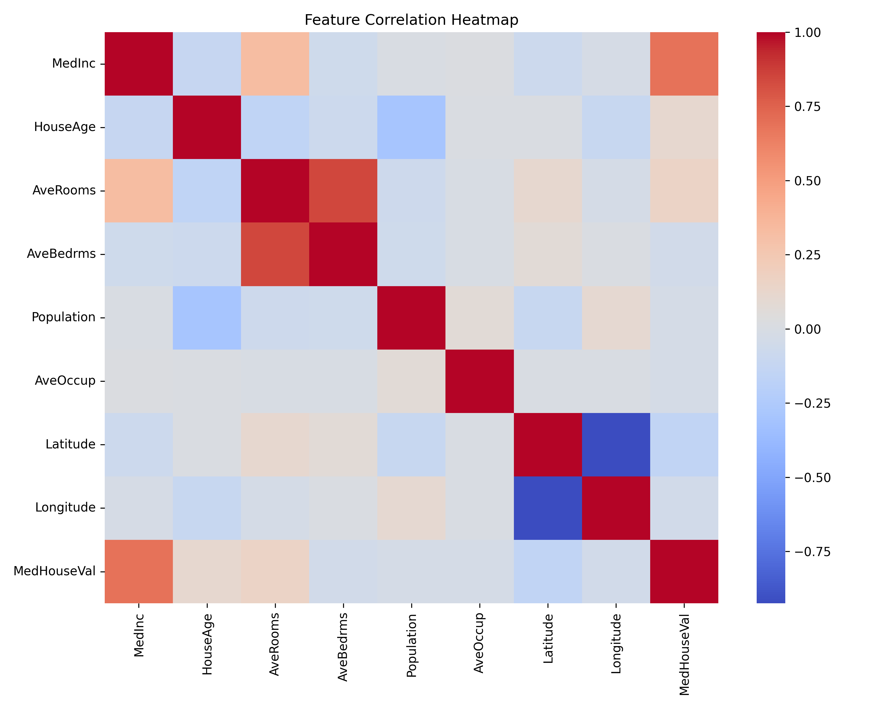
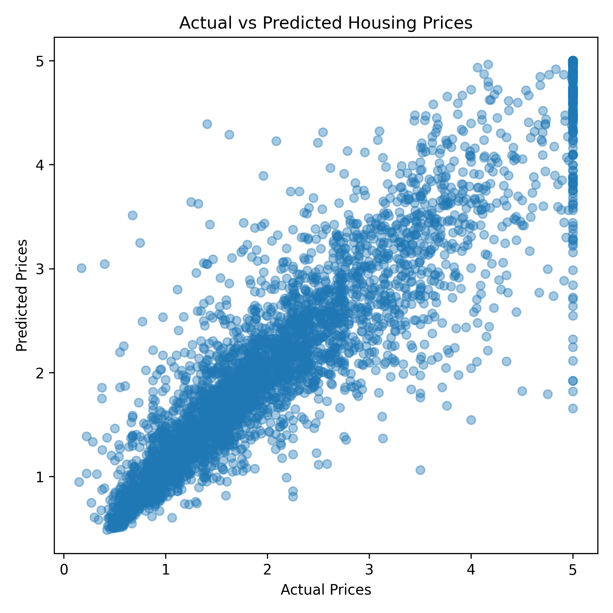

# 🏡 California Housing Price Prediction  
### Random Forest Regression Model Using Built-In scikit-learn Data

This project builds a business-focused machine learning model that predicts **California housing prices** using the built-in `fetch_california_housing` dataset.  
It includes model evaluation, diagnostics, and visualizations that would be used in a real analytics or data science workflow.

---

## 📊 Project Overview

This model predicts median house values based on features such as:

- Median income  
- Average occupants  
- Latitude and longitude  
- Average rooms  
- House age  
- Population  

A **Random Forest Regressor** is used to capture nonlinear relationships and provide interpretable feature importances.

---

## 📈 Model Performance

| Metric | Value |
|--------|--------|
| **RMSE** | *(printed when script runs)* |
| **R² Score** | *(printed when script runs)* |

These performance metrics appear in your terminal when you run the script.

---

## 🖼️ Visualizations

### **📌 1. Feature Correlation Heatmap**  
Shows how input variables relate to each other and to the target value.



---

### **📌 2. Feature Importance (Random Forest)**  
Identifies which predictors contribute most to model accuracy.


---

### **📌 3. Actual vs Predicted Housing Prices**  
Evaluates how closely the model's predictions align with real values.



---

### **📌 4. Residuals Plot**  
Checks for bias and model fit issues.


---

### **📌 5. Distribution of Predicted Prices**  
Shows the distribution and density of predicted home values.


---

## 🗂️ File Structure

california-regression/
│── california_regression.py
│── README.md
└── Plots/
├── correlation_heatmap.png
├── feature_importance.png
├── actual_vs_predicted.png
├── residuals_plot.png
└── prediction_distribution.png

---

## ▶️ How to Run

Run this in your terminal:

```bash
python3 california_regression.py
