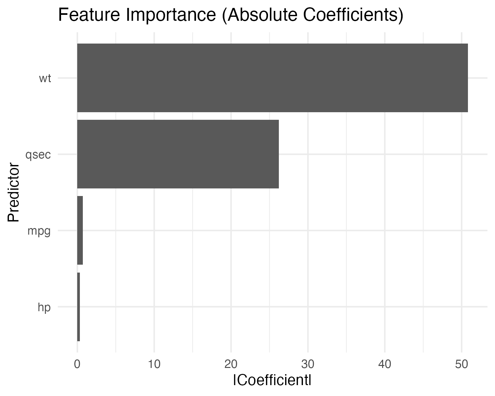

# Binary Classification in R

## Predicting Transmission Type with Logistic Regression

This project uses the built-in `mtcars` dataset to build a binary classification model that predicts whether a car has an automatic or manual transmission. The target variable is `am` (0 = automatic, 1 = manual), and the model uses engine and performance features as predictors.

This assignment reflects work completed in my Business Analytics coursework at the University of Tennessee, where we practiced supervised learning, model evaluation, and communicating results.

---

## Purpose

This project highlights my experience with:

- Preparing data for classification models  
- Building and interpreting logistic regression in R  
- Evaluating models using accuracy and ROC curves  
- Visualizing classification performance  
- Explaining feature importance in a way that non-technical stakeholders can understand  

---

## Methods

- **Dataset:** `mtcars` (built-in R dataset)  
- **Target:** `am` (0 = automatic, 1 = manual)  
- **Predictors:** `hp`, `wt`, `mpg`, `qsec`  
- **Model:** Logistic regression (`glm` with `family = binomial`)  
- **Split:** 70% training, 30% testing  
- **Metrics:** Accuracy, confusion matrix, ROC AUC  

---

## Visualizations

### 1. ROC Curve

Model performance across different classification thresholds.

---

### 2. Confusion Matrix Heatmap

Classification results on the test set.

---

### 3. Feature Importance

Standardized coefficient magnitudes to compare predictor influence.

---

## Files in This Project

| File | Description |
|------|-------------|
| **Logistic-Model.R** | Full reproducible R script for the classification analysis |
| **README.md** | Project overview, methods, and visual outputs |
| **Plots/** | Folder containing ROC curve, confusion matrix heatmap, and feature importance chart |

---

## Summary

This project demonstrates how I build, evaluate, and explain a binary classification model in R. It shows my ability to:

- Choose useful predictors  
- Train and validate a model  
- Interpret coefficients in a practical way  
- Communicate performance with clear visuals  

It reflects the same approach I bring to real problems: understand the question, structure the data, test models carefully, and present the results clearly.
